### Git
   * [一、安装及配置](#一安装及配置)
       * [Git安装](#Git安装)
	   * [Git用户名及邮箱配置](#Git用户名及邮箱配置)
   * [二、创建版本库及提交命令](#二创建版本库及提交命令)
       * [本地创建版本库](#本地创建版本库)
	   * [Git的三个存储空间](#Git的三个存储空间)
	   * [提交修改文件命令](#提交修改文件命令)
	   * [版本回退](#版本回退)
	   * [撤销修改（未提交到分支中）](#撤销修改)
   
   ## 一、安装及配置
   ### Git安装
   Git从网上下载就行，我的电脑是win10，一路傻瓜式操作就安装完了。
   
   ### Git用户名及邮箱配置
   用户名
   ```
   git config --global user.name "zhaoliang"
   ```
   用户邮箱
   ```
   git config --global user.email "lzhao*****@163.com"
   ```
   配置好后用以下命令查看
   ```
   git config user.name
   git config user.email
   ```
   <div align="center">
   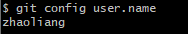
   </div>
   <div align="center">
   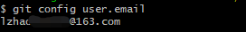
   </div>
   
   ## 二、创建版本库及提交命令
   ### 本地创建版本库
   首先创建一个文件夹，Git进入该文件夹，然后使用以下命令将本文件夹作为Git仓库
   ```
   git init
   ```
   <div align="center">
   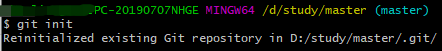
   </div>
   会发现文件后面会有master标记，说明此文件夹现在是Git仓库。
   
   ### Git的三个存储空间
   工作区：个人修改文件，工作的区域
   暂存区：暂时存储个人修改的文件的区域
   当前分支：多人共享的区域，用来版本控制，项目迭代
   ```
   git status
   ```
   查看文件状态（工作区是否有修改的文件，暂存区是否有文件）
   
   ### 提交修改文件命令
   单一个文件进行修改后（创建、修改、删除都属于修改），将文件同步到当前分支中，需要使用以下命令。
   ```
   git add [filename] //将文件从工作区提交到暂存区中
   git commit -m "第一次提交文件"  //将暂存区中的所有文件提交到当前分支中，-m为添加标记信息
   ```
   当工作区文件修改后，文件状态为
   <div align="center">
   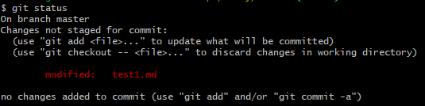
   </div>
   当文件提交到暂存区后，文件状态为
   <div align="center">
   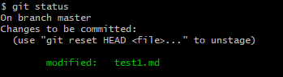
   </div>
   文件提交到当前分支后，文件状态为
   <div align="center">
   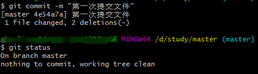
   </div>
   
   ### 版本回退
   使用git log命令查看已经提交的版本
   <div align="center">
   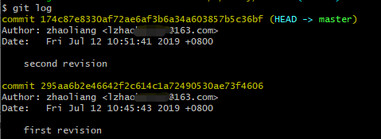
   </div>
   用git log --pretty=oneline可以查看的更清晰
   <div align="center">
   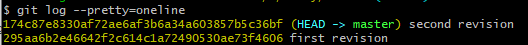
   </div>
   其中，十六进制码为版本id，用于切换到指定版本。
   
   如果要回退到上一个版本，可以使用以下命令。
   ```
   git reset --hard HEAD^
   git reset --hard HEAD~1
   ```
   可以看到，当前版本已经是上一个版本了
   <div align="center">
   
   </div>
   <div align="center">
   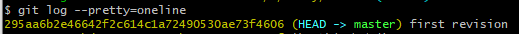
   </div>
   如果还想回到第二次修改的版本，可以使用以下命令。
   ```
   git reset --hard [版本id]
   ```
   <div align="center">
   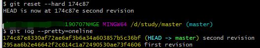
   </div>
   
   ### 撤销修改
   该方法适合修改的文件还没提交到分支中的情况。
   如果修改的文件还在工作区，还没有提交到暂存区，即是以下状态
   <div align="center">
   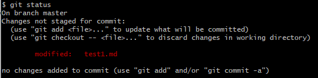
   </div>
   正如git的提示，使用以下命令撤销当前修改的内容
   <div align="center">
   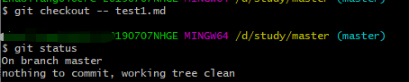
   </div>
   
   如果修改的内容提交到暂存区，如下图
   <div align="center">
   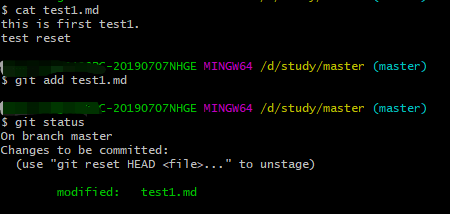
   </div>
   可以用以下命令把暂存区的文件退回到工作区
   ```
   git reset HEAD [filename]
   ```
   <div align="center">
   
   </div>
   如果文件被提交到分支上（commit了），就要用版本回退了