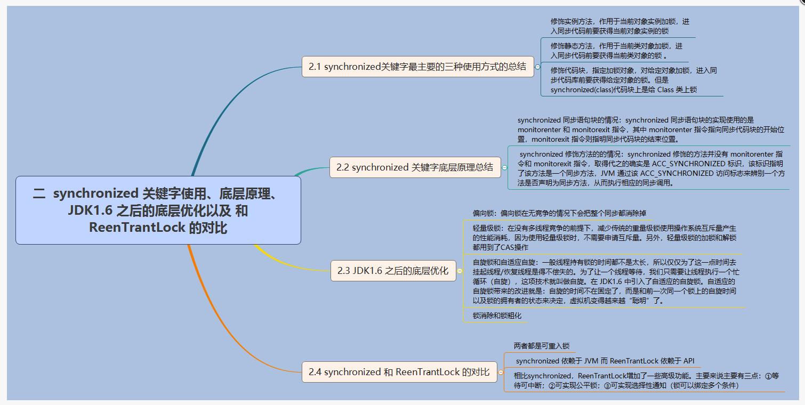

### synchronized

 <div align="center">
 
</div>

#### 使用方法

1、修饰实例方法，作用是给当前对象实例加锁，进入同步代码前要获得当前对象实例的锁。  

2、修饰静态方法，作用于当前类对象加锁，进入同步代码前要获得当前类对象的锁。会作用于类的所有对象实例。  

3、修饰代码块，指定加锁对象，对给定对象加锁，进入同步代码块前要获得给定对象的锁。

###### 双重校验锁实现对象单例（线程安全）

```java
public class Singleton {
  private volatile static Singleton uniqueInstance;
  
  private Singleton() {  
  }
  
  public static Singleton getSingleton() {
    if(uniqueInstance == null) {
      synchronized(Singleton.class) {
        if(uniqueInstance == null) {
          uniqueInstance = new Singleton();
        }
      }
    }
    return uniqueInstance;
  }
}
```

#### 原理

###### 同步代码块

使用的是monitorenter、monitorexit指令。线程试图获取monitor的持有权，当计数器为0时可以成功获取，计数器设置为1；当执行monitorexit指令后，将锁计数器设为0。

###### 修饰方法

使用ACC_SYNCHRONIZED标识

#### 1.6之后的优化

##### 偏向锁

在无竞争的情况下把整个同步消除掉。  

当第一个线程获取锁后，如果之后没有其他线程获取，则持有偏向锁的线程就不需要同步。

##### 轻量级锁

加锁和解锁使用CAS操作。

##### 自旋锁和自适应自旋

一般线程持有锁的时间不太长，而挂起线程、恢复线程消耗时间，为了让线程等待，让线程执行一个忙循环，这项技术叫自旋。

##### 锁消除

虚拟机检测到共享数据不可能存在竞争时，就会执行锁消除。消除请求锁的时间

##### 锁粗化

#### Synchronized和ReentrantLock对比

###### 都是可重入锁

###### synchronized依赖JVM、ReenTrantLock依赖API

###### ReentrantLock比Synchronized多一些功能

1、等待可中断。lock.lockInterruptibly()等待的线程可以放弃等待，去处理其他事情。  

2、可指定公平、非公平（默认），synchronized只能是非公平锁。  

3、选择性通知。线程对象可以注册在Condition中，lock中可以创建多个Condition实例，使用Condition实例的signalAll()方法可以唤醒制定Condition上的所有等待线程


