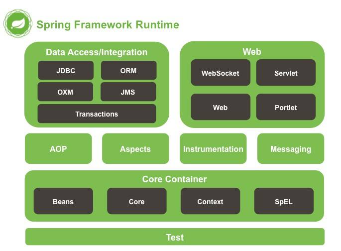

# 《Spring Boot实战》
   * [一、Spring基础](#一Sping基础)
     * [Spring的生态](#Spring的生态)
     * [项目构建工具Maven](#项目构建工具Maven)

## 一、Spring基础

 

### Spring的生态

Spring Boot：使用默认开发配置来实现快速开发  

Spring XD：用来简化大数据应用开发  

Spring Cloud：为分布式系统开发提供工具集  

Spring Data：对主流的关系型和NoSQL数据库的支持  

Spring Integration：通过消息机制对企业集成模式（EIP）对支持  

Spring Batch：简化及优化大量数据的批处理操作  

Spring Security：通过认证和授权保护应用  

Spring HATEOAS：基于HATEOAS原则简化REST服务开发  

Spring AMQP：对基于AMQP的消息的支持  

Spring Mobile：提供对手机设备检测对功能，给不同的设备返回不同的页面的支持  

Spring for Android：主要提供在Android上消费RESTful API的功能  

Spring Web Flow：基于Spring MVC提供基于向导流程式的Web应用开发  

Spring Web Services：提供了基于协议有限的SOAP/Web服务  

Spring LDAP：简化使用LDAP开发  

Spring Session：提供一个API及实现来管理用户会话消息  

### 项目构建工具Maven

Maven的项目中都存在一个pom.xml文件用来管理项目的依赖以及项目的编译等功能。  

##### 1、dependencies元素

此元素中包含多个项目依赖需要使用的<dependency></dependency>  

##### 2、dependency元素

内部通过groupId、artifactId以及version来确定唯一的依赖  

groupId：组织唯一标识  

artifactId：项目唯一标识  

version：版本唯一标识  

##### 3、properties元素

用来定义变量  

